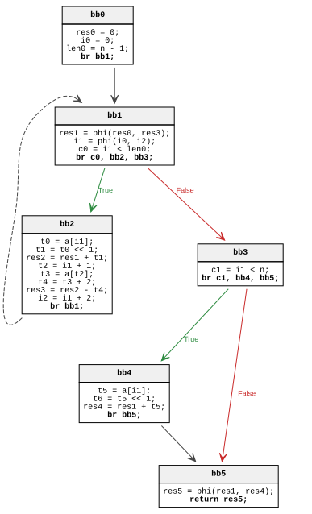
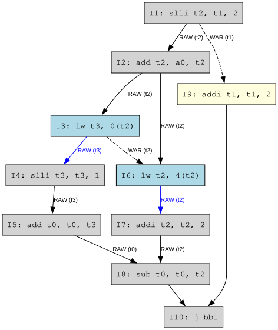

# Code generation

Полученная в прошлой части оптимизированная SSA-форма:

```C
int function2 (int* a, int n) {
bb0:
    res0 = 0;
    i0 = 0;
    len0 = n - 1;
    br bb1;
bb1:
    res1 = phi(res0, res3);
    i1 = phi(i0, i2);
    c0 = i1 < len0;
    br c0, bb2, bb3;
bb2:
    t0 = a[i1];
    t1 = t0 << 1;
    res2 = res1 + t1;
    t2 = i1 + 1;
    t3 = a[t2];
    t4 = t3 + 2;
    res3 = res2 - t4;
    i2 = i1 + 2;
    br bb1;
bb3:
    c1 = i1 < n;
    br c1, bb4, bb5;
bb4:
    t5 = a[i1];
    t6 = t5 << 1;
    res4 = res1 + t6;
    br bb5;
bb5:
    res5 = phi(res1, res4);
    return res5;
}
```

> В виде графа:




## Архитектура RISC-V

Кодогенерация производится в ассемблер **RISC-V** без особенных расширений. Временных регистров в **RISC-V** 7 штук: `t0-t6`. Аргументы функций сохраняются в регистрах `a0-a7`

### Легализация инструкций

Построим таблицу соответствия IR инструкциям машинного кода RISC-V:

* `x = <num>;` $\Rightarrow$ `li x, <num>`
* `y = x +- <num>;` $\Rightarrow$ `addi y, x, +-<num>`
* `c = a + b;` $\Rightarrow$ `add c, a, b`
* `c = a - b;` $\Rightarrow$ `sub c, a, b`
* `br bbN;` $\Rightarrow$ `j bbN`
* `c = a < b;` + `br c, bbN, bbM;` $\Rightarrow$ `blt a, b, bbN`
* `x = a[i];` $\Rightarrow$ `slli t, i, 2` + `add t, t, a` + `lw x, 0(t)`
* `y = x << 1;` $\Rightarrow$ `slli y, x, 1`
* `return x;` $\Rightarrow$ `mv a0, x` + `ret`

### Распределение регистров

#### Алгоритм

Регистры будут распределены линейным методом. 
1. Вычисляются  и сортируются по началу интервалы живых переменных: Для каждой переменной определяется диапазон [start,end], где start - первая точка определения, а end - последняя точка использования.

2. Линейное сканирование (используется список **Active**, интервалов, получивших регистр и ещё живых) для каждого интервала i:
    - Удаляются из списка **Active** все интервалы, которые закончились раньше, чем начался i и освобождаются их регистры.
    - Если есть свободный физический регистр, назначить его интервалу i и добавить i в список **Active**. Иначе выполняется **Spilling** (вытеснение): в стек вытесняется интервал из **Active**, который заканчивается позже всех.

#### Виртуальные регистры

Аргументы функций сохраняются в регистрах **a0-a7**, т.е. **a0** для `int *a` и **a1** для `int n`. 

Переобозначим все виртуальные регистры. Для регистров `resN` и `iN` используется по одному виртуальному регистру для разрешения *phi*-функций:

* **v0**: `res` (`res0-res5`).
* **v1**: `i` (`i0-i2`).
* **v2**: `len` (`len0`).
* **v3**: смещение для `a[i]` внутри `bb2`
* **v4**: адрес `a[i]` внутри `bb2`
* **v5**: `t0`
* **v6**: `t1`
* **v7**: `t3`
* **v8**: `t4`
* **v9**: смещение для `a[i]` внутри `bb4`
* **v10**: адрес `a[i]` внутри `bb4`
* **v11**: `t5`
* **v12**: `t6`

Пронумерованный код из виртуальных регистров:

1.  `li v0, 0`               // bb0: res0 = 0
2.  `li v1, 0`               // bb0: i0 = 0
3.  `addi v2, a1, -1`        // bb0: len0 = n - 1
4.  **bb1:**
5.  `bge v1, v2, bb3`        // bb1: c0 = i1 < len0 (выход из цикла)
6.  **bb2:**
7.  `slli v3, v1, 2`         // 
8.  `add v4, a0, v3`         // 
9.  `lw v5, 0(v4)`           // bb2: t0 = a[i]
10. `slli v6, v5, 1`         // bb2: t1 = t0 << 1 (замена * 2)
11. `add v0, v0, v6`         // bb2: res2 = res1 + t1
12. `lw v7, 4(v4)`           // bb2: t3 = a[i+1]
13. `addi v8, v7, 2`         // bb2: t4 = t3 + 2
14. `sub v0, v0, v8`         // bb2: res3 = res2 - t4
15. `addi v1, v1, 2`         // bb2: i2 = i1 + 2
16. `j bb1`                  // 
17. **bb3:**
18. `bge v1, a1, bb5`        // bb3: c1 = i1 < n
19. **bb4:**
20. `slli v9, v1, 2`         // 
21. `add v10, a0, v9`        // 
22. `lw v11, 0(v10)`         // bb4: t5 = a[i]
23. `slli v12, v11, 1`       // bb4: t6 = t5 << 1
24. `add v0, v0, v12`        // bb4: res4 = res1 + t6
25. **bb5:**
26. `mv a0, v0`              // 
27. `ret`                    // return res5

#### Таблица интервалов жизни

| Регистр | Интервал | Последнее использование |
| :--- | :--- | :--- |
| **v0** | [1, 26] | `mv a0, v0` |
| **v1** | [2, 20] | `slli v9, v1, 2` |
| **v2** | [3, 5] | `bge v1, v2, bb3` |
| **v3** | [7, 8] | `add v4, a0, v3` |
| **v4** | [8, 12] | `lw v7, 4(v4)` |
| **v5** | [9, 10] | `slli v6, v5, 1` |
| **v6** | [10, 11] | `add v0, v0, v6` |
| **v7** | [12, 13] | `addi v8, v7, 2` |
| **v8** | [13, 14] | `sub v0, v0, v8` |
| **v9** | [20, 21] | `add v10, a0, v9` |
| **v10** | [21, 22] | `lw v11, 0(v10)` |
| **v11** | [22, 23] | `slli v12, v11, 1` |
| **v12** | [23, 24] | `add v0, v0, v12` |


#### Сканирование

Используем физические регистры RISC-V: `t0-t6`.

| String |  vReg   |  Action   |               Active              |
|--------|---------|-----------|-----------------------------------|
| 1      | v0      | set t0    | {v0: t0}                          |
| 2      | v1      | set t1    | {v0: t0, v1: t1}                  |
| 3      | v2      | set t2    | {v0: t0, v1: t1, v2: t2}          |
| 5      | v2      | spill t2  | {v0: t0, v1: t1}                  |
| 7      | v3      | set t2    | {v0: t0, v1: t1, v3: t2}          |
| 8      | v3      | spill t2  | {v0: t0, v1: t1}                  |
| 8      | v4      | set t2    | {v0: t0, v1: t1, v4: t2}          |
| 9      | v5      | set t3    | {v0: t0, v1: t1, v4: t2, v5: t3}  |
| 10     | v5      | spill t3  | {v0: t0, v1: t1, v4: t2}          |
| 10     | v6      | set t3    | {v0: t0, v1: t1, v4: t2, v6: t3}  |
| 11     | v6      | spill t3  | {v0: t0, v1: t1, v4: t2}          |
| 12     | v4      | spill t2  | {v0: t0, v1: t1}                  |
| 12     | v7      | set t2    | {v0: t0, v1: t1, v7: t2}          |
| 13     | v7      | spill t2  | {v0: t0, v1: t1}                  |
| 13     | v8      | set t2    | {v0: t0, v1: t1, v8: t2}          |
| 14     | v8      | spill t2  | {v0: t0, v1: t1}                  |
| 20     | v9      | set t2    | {v0: t0, v1: t1, v9: t2}          |
| 20     | v1      | spill t1  | {v0: t0, v9: t2}                  |
| 21     | v9      | spill t2  | {v0: t0}                          |
| 21     | v10     | set t1    | {v0: t0, v10: t1}                 |
| 22     | v10     | spill t1  | {v0: t0}                          |
| 22     | v11     | set t1    | {v0: t0, v11: t1}                 |
| 23     | v11     | spill t1  | {v0: t0}                          |
| 23     | v12     | set t1    | {v0: t0, v12: t1}                 |
| 24     | v12     | spill t1  | {v0: t0}                          |
| 26     | v0      | spill t0  | {}                                |


Итоговая таблица распределения виртуальных регистров по физическим:

| Виртуальный регистр | Физический регистр |
| :--- | :--- |
| **v0** | **t0** |
| **v1** | **t1** |
| **v2** | **t2** |
| **v3, v4, v7, v8** | **t2** |
| **v5, v6** | **t3** |
| **v9** | **t2** |
| **v10, v11, v12** | **t1** |


#### Итоговый код RISC-V после распределения регистров 

```riscv
function2:
    li   t0, 0
    li   t1, 0
    addi t2, a1, -1
bb1:
    bge  t1, t2, bb3
bb2:
    slli t2, t1, 2 
    add  t2, a0, t2
    lw   t3, 0(t2)
    slli t3, t3, 1
    add  t0, t0, t3
    
    lw t2, 4(t2)
    addi t2, t2, 2
    sub t0, t0, t2
    addi t1, t1, 2
    j bb1
bb3:
    bge  t1, a1, bb5
bb4:
    slli t2, t1, 2
    add  t1, a0, t2
    lw   t1, 0(t1)
    slli t1, t1, 1
    add  t0, t0, t1
bb5:
    mv   a0, t0
    ret
```

### Планирование инструкций

Планирование инструкций произведем для самого большого базового блока `bb2`. Для расчетов приняты стандартные **RISC-V** задержки: `add`, `sub`, `alli`, `addi` - 1 такт (ALU), а для `lw` 2 такта.

Инструкции базового блока нумеруются и строится граф зависимостей по инструкциям:



Синем подcвечены инструкции, требующие двух тактов.

#### Списочное планирование

| Такт | Готовые для исполнения | Исполнение |
| :--- | :--- | :--- |
| **1** | {I1} | **I1**: `slli t2, t1, 2` |
| **2** | {I2, I9} | **I2**: `add t2, a0, t2` | 
| **3** | {I3, I6, I9} | **I3**: `lw t3, 0(t2)` | 
| **4** | {I6, I9} | **I6**: `lw t2, 4(t2)` |
| **5** | {I9} | **I9**: `addi t1, t1, 2` |
| **6** | {I4, I7} | **I4**: `slli t3, t3, 1` | 
| **7** | {I7, I5} | **I7**: `addi t2, t2, 2` |
| **8** | {I5} | **I5**: `add t0, t0, t3` |
| **9** | {I8} | **I8**: `sub t0, t0, t2` |
| **10** | {I10} | **I10**: `j bb1` |


Итоговый базовый блок `bb2` после оптимизации при планировании инструкций:

```risc-v
slli t2, t1, 2 
add  t2, a0, t2
lw   t3, 0(t2)
lw t2, 4(t2)
addi t1, t1, 2
slli t3, t3, 1
addi t2, t2, 2
add  t0, t0, t3
sub t0, t0, t2
j bb1
```

### Итоговая кодогенерация RISC-V

```riscv
function2:
    li   t0, 0
    li   t1, 0
    addi t2, a1, -1
bb1:
    bge  t1, t2, bb3
bb2:
    slli t2, t1, 2 
    add  t2, a0, t2
    lw   t3, 0(t2)
    lw t2, 4(t2)
    addi t1, t1, 2
    slli t3, t3, 1
    addi t2, t2, 2
    add  t0, t0, t3
    sub t0, t0, t2
    j bb1
bb3:
    bge  t1, a1, bb5
bb4:
    slli t2, t1, 2
    add  t1, a0, t2
    lw   t1, 0(t1)
    slli t1, t1, 1
    add  t0, t0, t1
bb5:
    mv   a0, t0
    ret
```