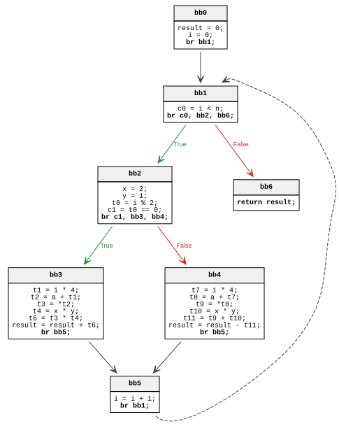
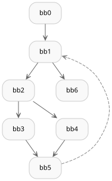
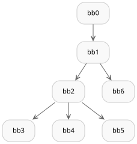
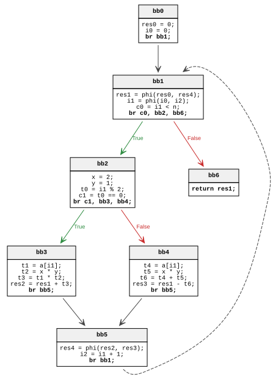
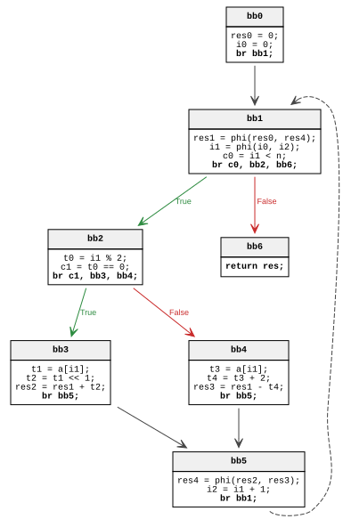

# Generic IR

## Задача

Дана программа на языке Си (в соответствии с Вашим вариантом). Требуется:
1. Описать программу
2. Построить граф потока управления, дерево доминаторов, граф фронта доминирования, промежуточное представление Generic IR из лекций в SSA форме для данной
функции.
3. Предложить оптимизации, которые можно применить к данной программе. Последовательно применить эти оптимизации к программе и построить промежуточное представление после применения каждой из них.

## Построение IR

Представленная программа на C:
```C
int function2 (int ∗a , int n) {
    int result = 0;
    for (int i = 0; i < n; ++i) {
        int x = 2;
        int y = 1;

        if (i % 2 == 0)
            result += a[i] * x * y;
        else
            result -= a[i] + x * y;
    }
    return result;
}
```

Для представления в трёхадресной форме, сначала представим цикл `for` в виде `do-while`

Из цикла:
```C
for (init-statement; condition; increment) {
    loop-body;
}
```
Получается:
```C
init-statement;
if (!condition)
    return;
do {
    loop-body;
    increment;
} while(condition);
```

Эквивалентная программа через `do-while`:

```C
0:   int function2 (int∗ a , int n) {
1:      int result = 0;
2:      int i = 0;
3:      if (!(i < n))
4:         return result;
5:      do {
6:          int x = 2;
7:          int y = 1;
8:          if (i % 2 == 0)
9:              result += a[i] * x * y;
10:         else
11:             result -= a[i] + x * y;
12:         i++;
13:     } while (i < n);
14:     return result;
15: }
```

Разобъём код на логические блоки:
* bb0: строки 1-2 (вход)
* bb1: строки 3 и 13 (проверка условия `i < n`)
* bb2: строки 6-8 (тело цикла)
* bb3: строка 9 (if true)
* bb4: строка 11 (else)
* bb5: строка 12 (инкремент и возврат к bb1)

Начальная трёхадресная форма:



> Для краткости в дальнейшем части обращения в память вида
> ```C
> t1 = i * 4;
> t2 = a + t1;
> t3 = *t2;
> ```
> будем обозначать как `t1 = a[i]`


Чтобы построить оптимальную SSA-форму требуется исследовать граф потока управления.

### Граф потока управления


### Дерево доминаторов



### Непосредственные доминаторы
| IDom(bb1) | IDom(bb2) | IDom(bb3) | IDom(bb4) | IDom(bb5) | IDom(bb6)
|-----------|-----------|-----------|-----------|-----------|----------
| bb0       | bb1       | bb2       | bb2       | bb2       | bb1


### Фронт доминирования

При построении фронта доминирования имеет смысл рассматривать только базовые блоки с несколькими предшественниками, так как другие ноды не будут пополнять множества доминирования. Рассмотрим **bb1** (предшественники bb0 и bb5) и **bb5** (предшественники bb3 и bb4):

**bb1**:
1) bb0: 
    * IDom(bb1) = bb0 $\Rightarrow$ пропускаем
2) bb5:
    * Добавляем bb1 в DF(bb5) 
    * IDom(bb5) = bb2 $\Rightarrow$ добавляем bb1 в DF(bb2)
    * IDom(bb2) = bb1 $\Rightarrow$ добавляем bb1 в DF(bb1)
    * IDom(bb1) = bb0 = IDom(bb1) $\Rightarrow$ остановка

**bb5**:
1) bb3:
    * Добавляем bb5 в DF(bb3)
    * IDom(bb3) = bb2 = IDom(bb5) $\Rightarrow$ остановка
2) bb4:
    * Добавляем bb5 в DF(bb4)
    * IDom(bb4) = bb2 = IDom(bb5) $\Rightarrow$ остановка

Итого:

| DF(bb0) | DF(bb1) | DF(bb2) | DF(bb3) | DF(bb4) | DF(bb5) | DF(bb6)
|---------|---------|---------|---------|---------|---------|---------
| $\emptyset$ | {bb1}   | {bb1}   | {bb5}   | {bb5}   | {bb1}   | $\emptyset$


### $\phi$-функции

Оптимально разместим $\phi$-функции: 
1. **result** в блоках bb0, bb3, bb4

    DF(bb4) = DF(bb3) = {bb5} $\Rightarrow$ вставляются res1 = phi(res0, res3) в bb1, так как DF(bb5) = {bb1}, и res4 = phi(res2, res3) в bb5.

2. **i** в блоках bb0, bb5

    DF(bb5) = {bb1} $\Rightarrow$ вставляется i1 = phi(i0, i2) в bb1.
    
### IR в оптимальной SSA-форме



## Оптимизации

### Свёртка констант

Первая очевидная оптимизация - это свёртка констант, в частности `x` и `y`: 

`x * y` $\Rightarrow$ `2 * 1` $\Rightarrow$ `2`. 

После неё сразу можно применить следующую оптимизацию операции умножения на 2 - замену на эквивалентную операцию побитового сдвига `<<` на степень двойки: 

`a[i] * 2` $\Rightarrow$ `a[i] << 1`

Получившийся код:
```C
int function2 (int ∗a , int n) {
    int result = 0;
    for (int i = 0; i < n; ++i) {
        if (i % 2 == 0)
            result += a[i] << 1;
        else
            result -= a[i] + 2;
    }
    return result;
}
```

SSA-форма после свёртки констант и оптимизации умножения:



### Развёртка цикла

Следующая цикловая оптимазация связана с тем, чтобы убрать из цикла проверку условия и обрабатывать в теле сразу 2 итерации (чётную и нечётную). Нужно учесть, что `n` может быть нечётным и обработать последний элемент. Вычисление `n - 1` перед циклом.

```C
int function2 (int ∗a , int n) {
    int result = 0;
    int i = 0;
    int len = n - 1;
    for (; i < len; i += 2) {
        result += a[i] << 1;
        result -= a[i + 1] + 2;
    }
    if (i < n)
        result += a[i] << 1;

    return result;
}
```

SSA-форма после применения цикловой оптимизации


